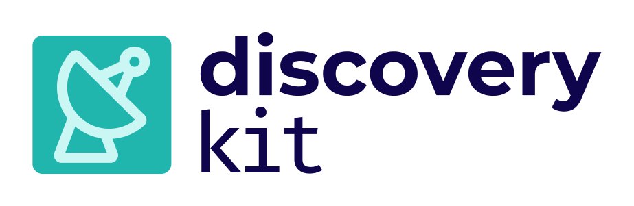

# Steadybit DiscoveryKit

The Steadybit DiscoveryKit enables the extension of Steadybit with new discovery capabilities.

At this moment, DiscoveryKit can be considered an **open-alpha**. The contracts and APIs *may* change. If you want to learn
more, [reach out to us](https://www.steadybit.com/contact).

## Getting Started

We recommend that you read the following documentation to get started with DiscoveryKit.

- [Discovery API](/docs/discovery-api.md)

- [Discovery Registration](/docs/discovery-registration.md)

- [Terminology](/docs/terminology.md)

- [Examples](/docs/examples.md)