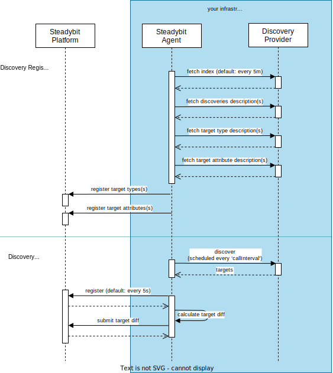

# Discovery API

This document explains the discovery API, control flow and the contracts behind it. It starts with a high-level overview and then explains every API in detail.

## Overview

Discoveries are implemented with the help of DiscoveryKit and the discovery API through the implementation of a discovery provider. Discovery providers are HTTP servers implementing the discovery API to describe which discoveries are supported and how to execute these. The following diagram illustrates who is issuing calls and in what phases. Besides discoveries, the discovery provider can describe new target types and attributes, which the platform user interface will use to display and select targets.



As can be seen above, the discovery provider is called by the Steadybit agent in two phases:

- In the discovery registration phase, Steadybit learns about the supported discoveries and its targets. Once this phase is completed, discoveries will be
  scheduled within the agent.
- The discovery will be called by the agent's scheduler in the execution phase.

The following sections explain the various API endpoints, their responsibilities and structures in more detail.

## Index Response

As the name implies, this is the root of a discovery provider and returns a list of supported discoveries, target type and target attribute descriptions. Or,
more specifically, HTTP endpoints that the agent should call to learn more about them.

This endpoint needs to be [registered with Steadybit agents](./discovery-registration.md).

### Example

```json
// Request: GET /

// Response: 200
{
  "discoveries": [
    {
      "path": "/discoveries/cats"
    },
    {
      "path": "/discoveries/dogs"
    }
  ],
  "targetTypes": [
    {
      "path": "/targettypes/cat"
    },
    {
      "path": "/targettypes/dog"
    }
  ],
  "targetAttributes": [
    {
      "path": "/targetattributes/pets"
    }
  ]
}
```

### References

- [TypeScript API](https://github.com/steadybit/discovery-kit/tree/main/typescript-api): `IndexResponse`
- [JSON Schema](https://github.com/steadybit/discovery-kit/tree/main/json-schema): `indexResponse`

## Discovery Description

A discovery description is required for each discovery. The HTTP endpoint serving the description is discovered through the index endpoint.

Discovery descriptions expose information about the endpoint, the call interval and an optional restriction where to run the discovery.

### restrictTo

Remember that the discoveries will be executed on all agents where the endpoints are configured. For example, if you apply the endpoint configuration to a Kubernetes daemonset, you may have multiple instances fetching the same target data. This could lead to duplicate targets in the platform (technically, each target's unique ID includes the agent ID). The `restrictTo`-attribute helps restrict the discovery execution to specific contexts. Currently, there are two supported values.

- `ANY`, the default, will run the discovery on every agent
- `LEADER`, will only call the discovery from a single Kubernetes pod in your cluster - the current leader.

### Example

```json
// Request: GET /discoveries/cats

// Response: 200
{
  "id": "cats-discovery",
  "discover": {
    "path": "/discoveries/cats/discover",
    "callInterval": "10s"
  },
  "restrictTo": "LEADER"
}
```

### References

- [TypeScript API](https://github.com/steadybit/discovery-kit/tree/main/typescript-api): `DescribeDiscoveryResponse`
- [JSON Schema](https://github.com/steadybit/discovery-kit/tree/main/json-schema): `describeDiscoveryResponse`

## Target Type Description

The `targetType` specifies how the platform should display targets in the user interface. All attacks are associated with a single target type. Among others, this helps to narrow down the targets for an attack.

A common use-case is [to define](#target-type-description) a custom `targetType`. Still, it's also possible to let your discovery report additional targets from one of Steadybit's pre-defined target types (for example, hosts, containers or Kubernetes deployments. If you report targets for existing target types, keep in mind that there are attacks that require specific attributes for attack execution.

### Versioning

Target types are versioned strictly, and Steadybit will ignore definition changes for the same version. Remember to update the version every time you update the target type description.

### Example

```json
// Request: GET /targettypes/cat

// Response: 200
{
  "id": "cat",
  "version": "1.0.0",
  "label": {
    "one": "cat",
    "other": "cats"
  },
  "category": "animals",
  "icon": "data:image/svg+xml;base64,PD94bWwgdmVyc2lvbj0iMS4wIiBlbmNvZGluZz0iaXNvLTg4NTktMSI/Pg0KPCEtLSBHZW5lcmF0b3I6IEFkb2JlIElsbHVzdHJhdG9yIDE5LjAuMCwgU1ZHIEV4cG9ydCBQbHVnLUluIC4gU1ZHIFZlcnNpb246IDYuMDAgQnVpbGQgMCkgIC0tPg0KPHN2ZyB2ZXJzaW9uPSIxLjEiIGlkPSJDYXBhXzEiIHhtbG5zPSJodHRwOi8vd3d3LnczLm9yZy8yMDAwL3N2ZyIgeG1sbnM6eGxpbms9Imh0dHA6Ly93d3cudzMub3JnLzE5OTkveGxpbmsiIHg9IjBweCIgeT0iMHB4Ig0KCSB2aWV3Qm94PSIwIDAgNDkuOTg5IDQ5Ljk4OSIgc3R5bGU9ImVuYWJsZS1iYWNrZ3JvdW5kOm5ldyAwIDAgNDkuOTg5IDQ5Ljk4OTsiIHhtbDpzcGFjZT0icHJlc2VydmUiPg0KPGc+DQoJPGc+DQoJCTxwYXRoIGQ9Ik00OS41NjUsMC4yOTJjLTAuMjc0LTAuMjczLTAuNjgyLTAuMzYzLTEuMDQ0LTAuMjM0TDM1Ljk0OCw0LjU2NUMzMi42MTQsMi44NzgsMjguODgsMS45ODksMjUuMTIsMS45ODkNCgkJCWMtMy44LDAtNy41NywwLjkwOC0xMC45MzMsMi42MjlsLTEyLjcyLTQuNTZjLTAuMzYzLTAuMTI5LTAuNzctMC4wMzktMS4wNDQsMC4yMzRDMC4xNSwwLjU2NiwwLjA1OSwwLjk3MywwLjE4OSwxLjMzNw0KCQkJbDQuMzg3LDEyLjIzN0MyLjMxMywxNy4zMTIsMS4xMiwyMS41OTMsMS4xMiwyNS45ODljMCwxMy4yMzMsMTAuNzY2LDI0LDI0LDI0YzEzLjIzMywwLDI0LTEwLjc2NywyNC0yNA0KCQkJYzAtNC41MDMtMS4yNDktOC44NzMtMy42MTUtMTIuNjcyTDQ5LjgsMS4zMzdDNDkuOTMsMC45NzMsNDkuODM5LDAuNTY2LDQ5LjU2NSwwLjI5MnogTTQzLjQ1NywxMy4xMDMNCgkJCWMtMC4xMDUsMC4yOTUtMC4wNjcsMC42MjIsMC4xMDQsMC44ODRjMi4zMjgsMy41NywzLjU1OSw3LjcyMSwzLjU1OSwxMi4wMDJjMCwxMi4xMzEtOS44NjksMjItMjIsMjJzLTIyLTkuODY5LTIyLTIyDQoJCQljMC00LjE4MSwxLjE3Ny04LjI0OCwzLjQwNS0xMS43NjNjMC4xNjUtMC4yNjEsMC4yMDEtMC41ODIsMC4wOTctMC44NzNMMi43ODYsMi42NTZsMTEuMTQsMy45OTMNCgkJCWMwLjI2NywwLjA5NSwwLjU2MSwwLjA3MywwLjgxLTAuMDYxYzMuMTcxLTEuNyw2Ljc2Mi0yLjYsMTAuMzg0LTIuNmMzLjU4NCwwLDcuMTQyLDAuODgxLDEwLjI4NywyLjU0OQ0KCQkJYzAuMjQ4LDAuMTMyLDAuNTQxLDAuMTUyLDAuODA2LDAuMDU4bDEwLjk5LTMuOTRMNDMuNDU3LDEzLjEwM3oiLz4NCgkJPGNpcmNsZSBjeD0iMTYuMTMiIGN5PSIyMS45OTkiIHI9IjIiLz4NCgkJPGNpcmNsZSBjeD0iMzQuMTMiIGN5PSIyMS45OTkiIHI9IjIiLz4NCgkJPHBhdGggZD0iTTM0LjEzLDMzLjk5OWMwLDIuMjA2LTEuNzk0LDQtNCw0cy00LTEuNzk0LTQtNHYtMC4wODFjMi4yNzktMC4zNzIsNC0xLjk4Nyw0LTMuOTE5YzAtMi4yMDYtMi4yNDMtNC01LTRzLTUsMS43OTQtNSw0DQoJCQljMCwxLjkzMiwxLjcyMSwzLjU0Nyw0LDMuOTE5djAuMDgxYzAsMi4yMDYtMS43OTQsNC00LDRzLTQtMS43OTQtNC00di0xaC0ydjFjMCwzLjMwOSwyLjY5MSw2LDYsNmMyLjA4NiwwLDMuOTI0LTEuMDcxLDUtMi42OQ0KCQkJYzEuMDc2LDEuNjIsMi45MTQsMi42OSw1LDIuNjljMy4zMDksMCw2LTIuNjkxLDYtNnYtMWgtMlYzMy45OTl6IE0yMi4xMywyOS45OTljMC0xLjA4NCwxLjM3NC0yLDMtMnMzLDAuOTE2LDMsMnMtMS4zNzQsMi0zLDINCgkJCVMyMi4xMywzMS4wODMsMjIuMTMsMjkuOTk5eiIvPg0KCTwvZz4NCjwvZz4NCjxnPg0KPC9nPg0KPGc+DQo8L2c+DQo8Zz4NCjwvZz4NCjxnPg0KPC9nPg0KPGc+DQo8L2c+DQo8Zz4NCjwvZz4NCjxnPg0KPC9nPg0KPGc+DQo8L2c+DQo8Zz4NCjwvZz4NCjxnPg0KPC9nPg0KPGc+DQo8L2c+DQo8Zz4NCjwvZz4NCjxnPg0KPC9nPg0KPGc+DQo8L2c+DQo8Zz4NCjwvZz4NCjwvc3ZnPg0K",
  "table": {
    "columns": [
      {
        "attribute": "pet.name"
      },
      {
        "attribute": "pet.age"
      },
      {
        "attribute": "pet.owner"
      }
    ],
    "orderBy": [
      {
        "attribute": "pet.name",
        "direction": "ASC"
      }
    ]
  }
}
```

### References

- [TypeScript API](https://github.com/steadybit/discovery-kit/tree/main/typescript-api): `DescribeTargetTypeResponse`
- [JSON Schema](https://github.com/steadybit/discovery-kit/tree/main/json-schema): `describeTargetTypeResponse`

## Target Attribute Description

You can provide a list of attribute definitions. The platform will use these attribute definitions to render human-readable column headers or labels. Attribute definitions are optional. By default, all `.` are replaced by a space to generate human-readable labels.

### Example

```json
// Request: GET /targetattributes/pets

// Response: 200
{
  "attributes": [
    {
      "attribute": "pet.name",
      "label": {
        "one": "pet name",
        "other": "pet names"
      }
    },
    {
      "attribute": "pet.age",
      "label": {
        "one": "pet age",
        "other": "pet ages"
      }
    },
    {
      "attribute": "pet.owner",
      "label": {
        "one": "pet owner",
        "other": "pet owner"
      }
    }
  ]
}
```

### References

- [TypeScript API](https://github.com/steadybit/discovery-kit/tree/main/typescript-api): `DescribeTargetAttributeResponse`
- [JSON Schema](https://github.com/steadybit/discovery-kit/tree/main/json-schema): `describeTargetAttributeResponse`

## Discovery Execution

Discoveries are scheduled by the agent. Steadybit will use the `callIntervall` provided in the discovery description. The endpoint needs to return a list of all discovered targets.

### Example

```json
// Request: GET /discoveries/cats/discover

// Response: 200
{
  "targets": [
    {
      "id": "garfield",
      "label": "Garfield",
      "targetType": "cat",
      "attributes": {
        "pet.name": [
          "Garfield"
        ],
        "pet.age": [
          "42"
        ],
        "pet.owner": [
          "Daniel"
        ]
      }
    },
    {
      "id": "kitty",
      "label": "Kitty",
      "targetType": "cat",
      "attributes": {
        "pet.name": [
          "Kitty"
        ],
        "pet.age": [
          "0"
        ],
        "pet.owner": [
          "Ben"
        ]
      }
    }
  ]
}
```

### References

- [TypeScript API](https://github.com/steadybit/discovery-kit/tree/main/typescript-api): `DiscoverResponse`
- [JSON Schema](https://github.com/steadybit/discovery-kit/tree/main/json-schema): `discoverResponse`
